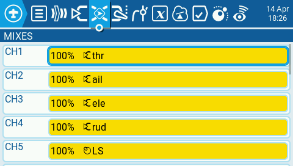
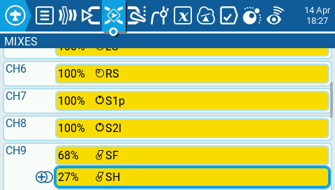
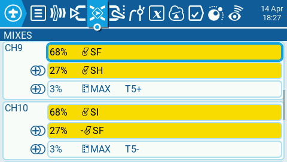
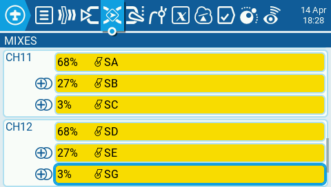

**README.md**

**🕹️ RC Protocol Tools for RP2040**

A collection of tools for receiving, decoding, converting, and debugging **CRSF** and **SBUS** RC protocols on the **RP2040** platform (Raspberry Pi Pico, Waveshare RP2040 Zero, etc.).

These projects focus on:

*   **USB joystick emulation**
*   **protocol debugging**
*   **serial bridging**
*   **signal inversion tools**
*   **practical utilities for RC transmitters and receivers**

All projects are written for the **RP2040 core** and use **Adafruit TinyUSB** for HID functionality where applicable.

* * *

**📦 Project Overview**

**1\. CRSF\_joystick**

**CRSF → USB Joystick converter**

This project reads **CRSF channel frames** (Crossfire / ELRS) from Serial and converts them into a **USB gamepad** recognized by Windows, Linux, macOS, Steam, and Gamepad Tester.

**Features**

*   Decodes CRSF channel frames (16 channels, 11‑bit)
*   Maps CH1–CH8 → **8 axes**
*   Maps CH9–CH12 → **32 buttons (multiplexed)**
*   **Tri-State compatible**
*   Fully **Gamepad Tester–compatible** HID descriptor
*   High update rate
*   No external libraries required (custom CRSF parser)

**Usage**

*   Connect CRSF RX to an RP2040 UART pin
*   Signal CRSF input on GPIO 5.
*   Joystick output via USB.
*   Support for 12 multiplexed switches.
*   Select **Adafruit TinyUSB** as USB stack in Arduino IDE

* * *

**2\. CRSF\_serial**

**CRSF → Serial**

A minimal CRSF decoder that does **not** emulate a joystick.  
It simply:

*   receives CRSF data on pin 5
*   prints them to the USB Serial output

Perfect for:

*   verifying receiver output
*   testing baudrate and pin mapping
*   checking channel activity
*   confirming CRSF frame integrity

**Features**

*   Lightweight CRSF state machine
*   Prints CH1–CH16 continuously
*   No HID, no overhead

* * *

**3\. sBus\_joystick**

**SBUS → USB Joystick converter**

This project converts **SBUS** (FrSky, Futaba, Radiomaster, etc.) into a USB joystick.

**Features**

*   Decodes SBUS frames (25 bytes)
*   Maps CH1–CH8 → axes
*   Maps CH9–CH12 → buttons (Multiplexed 3 switches input with 68%, 27% and 3%)
*   **Tri-State compatible**
*   Gamepad‑compatible HID descriptor

*   Uses **inverted SBUS** input
*   Three position switches are outputted in a tri-state compatible order (low,high and mid).

*   * * *
    

**4\. sBus\_to\_inverted\_serial**

**SBUS → normal UART converter**

SBUS is inverted by default.  
This tool converts an **inverted SBUS signal** into a **non‑inverted UART stream**, making it readable by:

*   logic analyzers
*   USB‑serial adapters
*   other microcontrollers
*   debugging tools

**Features**

*   Reads inverted SBUS
*   Re‑transmits channel values via **standard UART**
*   Useful for protocol analysis and bridging

* * *

**5\. sBus\_debug**

**SBUS debugging and visualization tool**

A comprehensive SBUS debugging utility that:

*   decodes SBUS frames
*   prints channel values
*   displays value information per channel on serial output

**Features**

*   Ideal for troubleshooting receivers
*   diagnostic

* * *

**🔧 Hardware Requirements**

*   RP2040 board (Pico, RP2040 Zero, Waveshare RP2040, etc.)
*   CRSF or SBUS receiver
*   USB cable
*   Optional: SBUS inverter (depending on project)

* * *

**🖥️ USB Joystick Functionality**

Joystick‑based projects use:

*   **Adafruit TinyUSB**
*   **Gamepad‑compatible HID descriptors**
*   32 joystick buttons

o   6 times 2 position switches. Multiplexed with 68%, 27% and 3%

o   6 times 3 position switches. Multiplexed with 68%, 27% and 3%

*   8 axes (16‑bit)
*   20‑byte HID report

Compatible with:

*   Windows 10/11
*   macOS
*   Linux
*   Steam Input
*   Gamepad Tester

* * *
**🚀Multiplex switches **
Example channel configuration. 

* * *

**🚀 Future Enhancements**

*   OLED display for channel visualization
*   PIO‑based SBUS decoder
*   CRSF telemetry passthrough
*   WebUSB configuration interface

* * *

**📜 Creative Common License**

*   Attribution-NonCommercial-ShareAlike
*   https://creativecommons.org/licenses/by-nc-sa/4.0/

* * *

**🎯 Summary**

This repository provides a complete toolkit for:

*   decoding CRSF and SBUS signals
*   converting RC protocols into USB joysticks
*   debugging receivers
*   bridging inverted and non‑inverted serial formats

All tools are optimized for the RP2040 and designed for clarity, stability, and reproducibility.
